# Programmieren mit Java [#9]: (Fortgeschritten | Online)



Die Kapitel sind so organisiert, dass ihr einen groben ueberblick bekommt.

## Projektstruktur

Die Ordnerstruktur sieht so aus:


```bash
java_9_fortgeschritten_online
|____Notizen
|____wichtigeDinge
|____Hausaufgaben
|____src
|    |____live_coding
|    |    |____kapitel1_grundlagen
|    |    |    |____HelloWorld_1.java
|    |    |    |____Variablen_2.java
|    |    |    |____Literale_3.java
|    |    |    |____...
|    |    |
|    |    |____kapitel2_flusskontrolle
|    |    |    |____IfElse_Anweisung_1.java
|    |    |    |____Switch_Anweisung_2.java
|    |    |    |____ForSchleife_3.java
|    |    |    |____...
|    |    |____...
|    |
|    |____resources
|    |    |____kapitel1_grundlagen
|    |    |    |____HelloWorld_1.java
|    |    |    |____Variablen_2.java
|    |    |    |____Literale_3.java
|    |    |    |____...
|    |    |
|    |    |____kapitel2_flusskontrolle
|    |    |    |____IfElse_Anweisung_1.java
|    |    |    |____Switch_Anweisung_2.java
|    |    |    |____ForSchleife_3.java
|    |    |    |____...
|    |    |____...
```

Dabei enthält jedes Kapitel (z.B., `kapitel1`, `kapitel2`, usw.) einzelne Java-Dateien (`HelloWorld.java`, `Variablen.java`, usw.)


# KursInhaltsübersicht

# A. Objekt-Orientierte Programmierung (OOP)

## Java Klassen & Objekte (Kapitel 1)
1. Syntax
2. static Modifikator
3. Klassen/Instanz Variablen
4. Klassen/Instanz Methoden
5. Konstruktoren
6. this Keyword
7. final Modifikator
8. public, private, protected Modifikatoren

## Java OOP Vertiefung (Kapitel 2) 
09. Vererbung
10. Super
11. Polymorphismus
12. Kapselung: (getter/Setter)
13. abstract
14. Interfaces
15. Inner Class
16. Enum

## Java erweiterte Themen (Kapitel 3)
17. Error Handling: (try, catch, throw)
18. JavaDoc
19. toString
20. Lambda
21. Recursion
22. I/O Streams

## Collections Framework (Kapitel 4)
23. List
24. ArrayList
25. Queue, Map, Set


# Weitere Infos

Schaut auf unserer [Website](https://www.mathcodelab.de/laufende_kurse/informatik_kurse/uni/java9/java_9_generell.html) vorbei für zusätzliche Informationen und Infos zum Kurs.

# Telegram-Gruppe

Tretet unserer [Telegram-Gruppe](https://t.me/mathcodelab/2303) bei, um euch mit anderen Studis auszutauschen.

Viel Spaß beim Programmieren!
